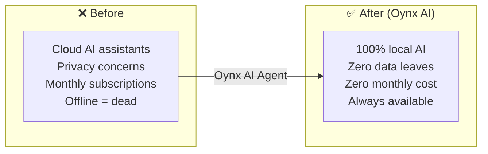
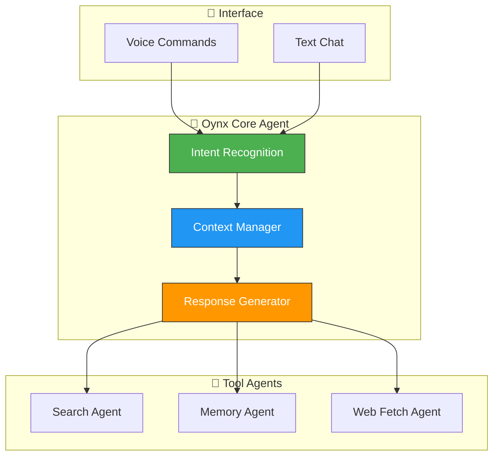

# 🧠 Oynx AI — Local AI Assistant Agent

> **Oynx AI: Your personal autonomous AI assistant — running 100% locally**  
> Voice-enabled, privacy-first, tool-equipped.

---

## ❌ The Problem

Most AI assistants are cloud-dependent — your conversations get sent to third-party servers, you pay monthly subscriptions, and you're limited to what the provider offers. When the internet is down or the service changes its terms, your assistant stops working. Privacy-conscious users have no good alternative to Siri, Alexa, or ChatGPT.

**Before:** Cloud-dependent voice assistants (Alexa, Siri, Google) with privacy concerns, monthly fees, no customization, offline dead zones.

**After (AI Agent):** Oynx runs 100% locally on your own machine — LM Studio + DeepSeek R1. Voice commands, text chat, search, memory, and book analysis. No internet needed. No data leaves your computer. No monthly fees.

---

## 🔄 Before vs After

## 🧠 AI Agent Architecture

Built by **[Shazaly Musa](https://github.com/SparkSpheartech)** — Founder, SparkSphear Tech  
*AI Agents for Local Personal AI Assistants*